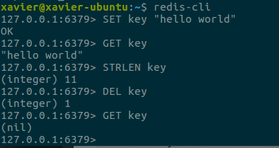
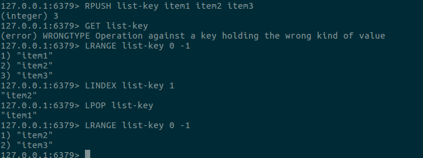
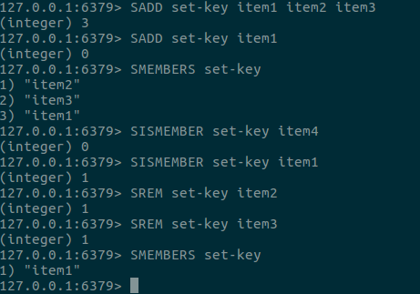
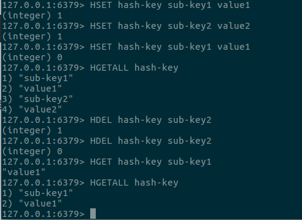
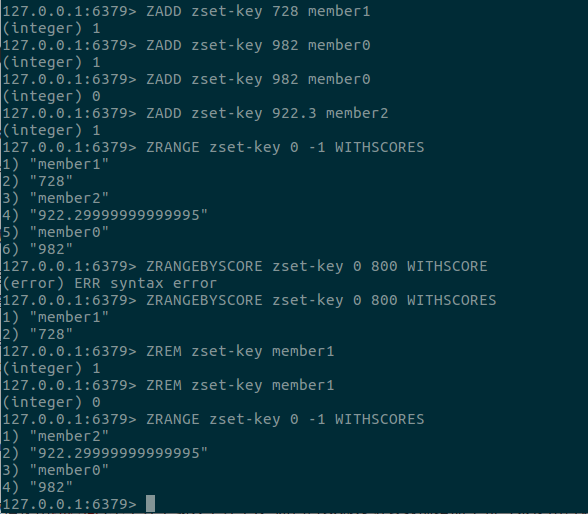

## 1 字符串命令
```bash
# 将字符串"hello world"关联到键key
SET key "hello world"
# 获取键key的值
GET key
# 返回key所储存的字符串值的长度(不计算最后的'\0'结尾标志符)
STRLEN key
# 删除键key
DEL key
# 重新获取键key
GET key
```


## 2 列表命令
```bash
# 将一个或多个值 value 插入到列表 key 的表尾(最右边)
RPUSH list-key item1 item2 item3
# 返回列表 key 中指定区间内的元素，区间以偏移量 start 和 stop 指定，不能使用GET,因为GET命令只适用于字符串键
LRANGE list-key 0 -1
# 返回列表 key 中，下标为 index 的元素
LINDEX list-key 1
# 移除并返回列表 key 的头元素
LPOP list-key
LRANGE list-key 0 -1
```


## 3 集合命令
```bash
# 将一个或多个 member 元素加入到集合 key 当中，已经存在于集合的 member 元素将被忽略
SADD set-key item1 item2 item3
SADD set-key item1
# 返回集合 key 中的所有成员。
SMEMBERS set-key
# 判断 member 元素是否集合 key 的成员
SISMEMBER set-key item4
SISMEMBER set-key item1
# 移除集合 key 中的一个或多个 member 元素，不存在的 member 元素会被忽略
SREM set-key item2
SREM set-key item3
SMEMBERS set-key
```


## 4 散列命令
```bash
# HSET key field value
# 将哈希表 key 中的域 field 的值设为 value,如果域 field 已经存在于哈希表中，旧值将被覆盖
HSET hash-key sub-key1 value1
HSET hash-key sub-key2 value2
HSET hash-key sub-key1 value1
# 返回哈希表 key 中，所有的域和值, 在返回值里，紧跟每个域名(field name)之后是域的值(value)，所以返回值的长度是哈希表大小的两倍
HGETALL hash-key
# HDEL key field [field ...]
# 删除哈希表 key 中的一个或多个指定域，不存在的域将被忽略
HDEL hash-key sub-key2
HDEL hash-key sub-key2
# HGET key field
# 返回哈希表 key 中给定域 field 的值。
HGET hash-key sub-key1
HGETALL hash-key 
```


## 5 有序集合命令
```bash
# ZADD key score member [[score member] [score member] ...]
# 将一个或多个 member 元素及其 score 值加入到有序集 key 当中
# 如果某个 member 已经是有序集的成员，那么更新这个 member 的 score 值，并通过重新插入这个 member 元素，来保证该 member 在正确的位置上。
ZADD zset-key 728 member1
ZADD zset-key 982 member0
ZADD zset-key 982 member0
ZADD zset-key 922.3 member2
# ZRANGE key start stop [WITHSCORES]
# 返回有序集 key 中，指定区间内的成员
# 其中成员的位置按 score 值递增(从小到大)来排序。
ZRANGE zset-key 0 -1 WITHSCORES
# ZRANGEBYSCORE key min max [WITHSCORES] [LIMIT offset count]
# 返回有序集 key 中，所有 score 值介于 min 和 max 之间(包括等于 min 或 max )的成员。有序集成员按 score 值递增(从小到大)次序排列
ZRANGEBYSCORE zset-key 0 800 WITHSCORES
# ZREM key member [member ...]
# 移除有序集 key 中的一个或多个成员，不存在的成员将被忽略。
ZREM zset-key member1
ZREM zset-key member1

ZRANGE zset-key 0 -1 WITHSCORES
```
